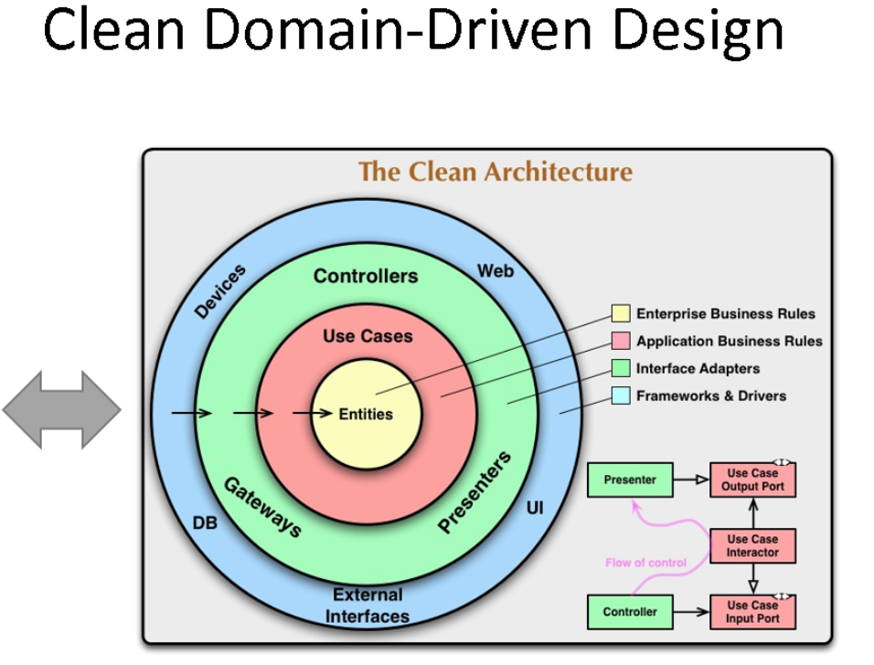
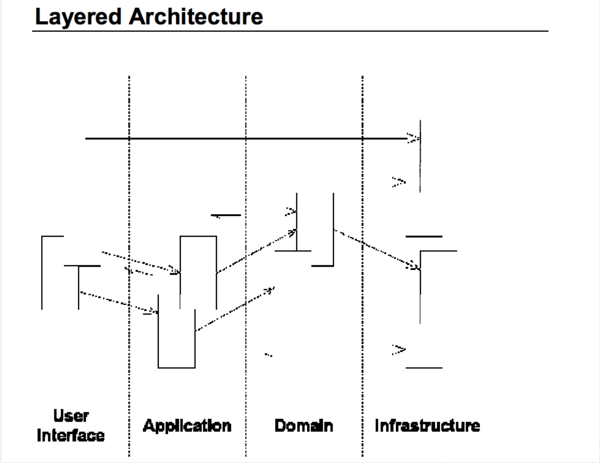

## overview(external) architecture

## overview(internal) architecture

---

## TODO 

- [ ] dockerize
- [ ] k8s
- [ ] deploy build sh
- [ ] missing usecases
- [ ] dapper must be inside proxy as a adapter
- [ ] sonar cloud
- [ ] add header for client request like other produc teams
- [ ] work under gateway

## Product includes

- [x] primary db : elk
- [ ] configuration proxy : pgsql
- [x] ticket proxy : sqlserver
- [ ] mail sender as a  adapter